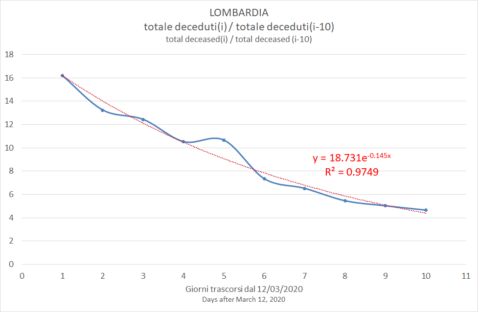

# parse_COVID-19
A Perl code to load the COVID-19 Italian dataset into an Excel file

(C) Roberto Bianconi 2020 

License: http://dev.perl.org/licenses/artistic.html

Installation:

You may need to install these Perl modules with cpan or cpanm. 

On Ubuntu, for example:
```
$ sudo apt-get cpanminus
$ sudo cpanm JSON
$ sudo cpanm File::Slurp
$ sudo cpanm Excel::Writer::XLSX
$ sudo cpanm Date::Calc
```
On Windows you can install www.strawberryperl.com and then:
```
> cpanm JSON
> cpanm File::Slurp
> cpanm Excel::Writer::XLSX
> cpanm Date::Calc
```

Usage:
```
$ perl parse_COVID-19.pl
```

The program retrieves the daily JSON summary https://github.com/pcm-dpc/COVID-19/blob/master/dati-json/dpc-covid19-ita-regioni.json and creates in ./out folder an Excel file with one sheet for each region with data stored for each day.

Set within code `$update = 0` to disable JSON file download.

The Excel file (not updated) is this one, see if it fits your needs: [COVID-19.xlsx](./out/COVID-19.xlsx)

## Peak estimate

The Excel also incudes the computation, for each region and each i-th day, of deceased(i)/deceased(j) for j={i-1,i-2,...,i-10}. This ratio could give an indication on the trend of death counts compared to death counts j days before. 

The tendency is inverted when the ratio becomes less than 1.

### Lombardy

Focusing on Lombardy from 12/3/2020 onward, the rate d(i)/d(10) is very well described by an exponential function (R > 0.97).



The exponential function has the form y = a\*exp(b\*i). So it is less than 1 when i > -ln(a)/b.


|Estimate (based on j=10) as of | a | b | R | Estimated peak date | Excel file | 
|-|-|-|-|-|-|
|22/03/2020| 18.731 | -0.145 | 0.9749 | 02/04/2020 |[COVID-19.xlsx](old/COVID-19_20200322.xlsx) | 


