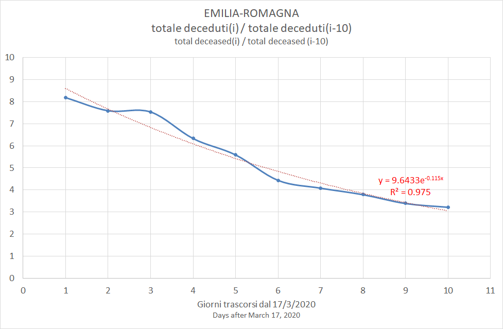

# parse_COVID-19
A Perl code to load the COVID-19 Italian dataset into an Excel file

(C) Roberto Bianconi 2020 

License: http://dev.perl.org/licenses/artistic.html

THIS PACKAGE IS PROVIDED "AS IS" AND WITHOUT ANY EXPRESS OR
IMPLIED WARRANTIES, INCLUDING, WITHOUT LIMITATION, THE IMPLIED
WARRANTIES OF MERCHANTIBILITY AND FITNESS FOR A PARTICULAR PURPOSE.


The program retrieves the daily JSON summary https://github.com/pcm-dpc/COVID-19/blob/master/dati-json/dpc-covid19-ita-regioni.json and creates in ./out folder an Excel file with one sheet for each region with data stored for each day.


The Excel file is this one, see if it fits your needs: [COVID-19.xlsx](./out/COVID-19.xlsx). You may need to execute the script to update its contents.

## Peak estimate of "system stress"

The Excel also incudes the computation, for each region and each i-th day, of cumulated_deceased(i)/cumulated_deceased(j) for j={i-1,i-2,...,i-10}. This ratio could give an indication on the trend of death counts compared to death counts up to j days before. 

The number of deaths depends not only on the number of infected people, but also on the capability of the health system to cope with the on-going situation.

The tendency of the stress on the system as whole is inverted when the ratio becomes cumulated_deceased(i)/cumulated_deceased(j) less than 1.

When the exponential function has the form y = a\*exp(b\*i), its value is less than 1 when i > -ln(a)/b. That gives the number of days away from the peak.

## Latest peak date estimates

Click on region names for daily plots.

### [Lombardy](lombardia/README.md)

### 27/03/2020


The estimated peak date is 23/4/2020.

### [Emilia-Romagna](emilia_romagna/README.md)



The estimated peak date is 6/4/2020.

## Installation and use:

You may need to install these Perl modules with cpan or cpanm. 

On Ubuntu, for example:
```
$ sudo apt-get cpanminus
$ sudo cpanm JSON
$ sudo cpanm File::Slurp
$ sudo cpanm Excel::Writer::XLSX
$ sudo cpanm Date::Calc
```
On Windows you can install www.strawberryperl.com and then:
```
> cpanm JSON
> cpanm File::Slurp
> cpanm Excel::Writer::XLSX
> cpanm Date::Calc
```

Usage:
```
$ perl parse_COVID-19.pl
```

Set within code `$update = 0` to disable JSON file download.

