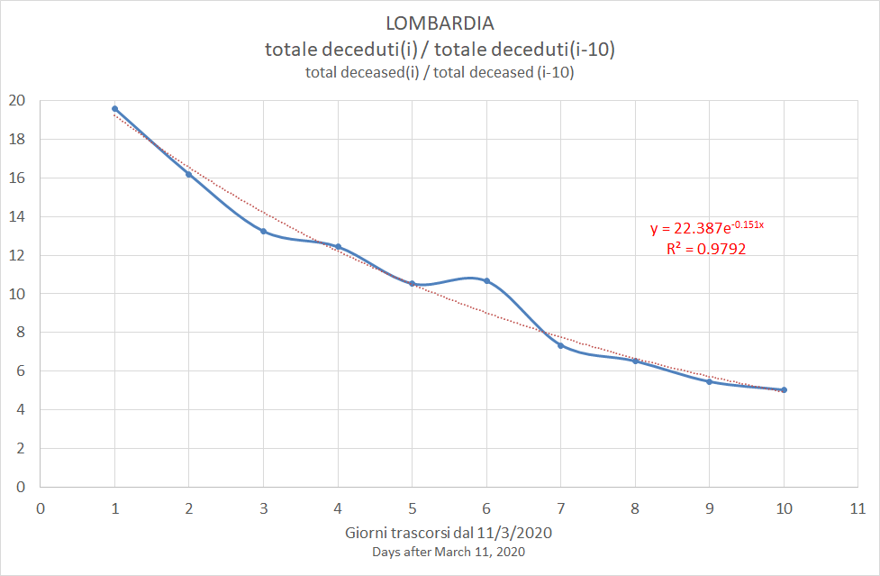
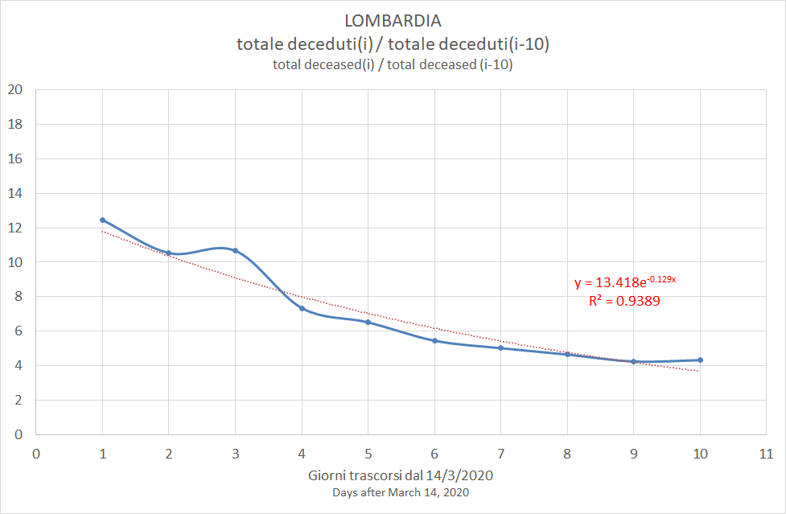

# parse_COVID-19
A Perl code to load the COVID-19 Italian dataset into an Excel file

(C) Roberto Bianconi 2020 

License: http://dev.perl.org/licenses/artistic.html

THIS PACKAGE IS PROVIDED "AS IS" AND WITHOUT ANY EXPRESS OR
IMPLIED WARRANTIES, INCLUDING, WITHOUT LIMITATION, THE IMPLIED
WARRANTIES OF MERCHANTIBILITY AND FITNESS FOR A PARTICULAR PURPOSE.

Installation:

You may need to install these Perl modules with cpan or cpanm. 

On Ubuntu, for example:
```
$ sudo apt-get cpanminus
$ sudo cpanm JSON
$ sudo cpanm File::Slurp
$ sudo cpanm Excel::Writer::XLSX
$ sudo cpanm Date::Calc
```
On Windows you can install www.strawberryperl.com and then:
```
> cpanm JSON
> cpanm File::Slurp
> cpanm Excel::Writer::XLSX
> cpanm Date::Calc
```

Usage:
```
$ perl parse_COVID-19.pl
```

The program retrieves the daily JSON summary https://github.com/pcm-dpc/COVID-19/blob/master/dati-json/dpc-covid19-ita-regioni.json and creates in ./out folder an Excel file with one sheet for each region with data stored for each day.

Set within code `$update = 0` to disable JSON file download.

The Excel file is this one, see if it fits your needs: [COVID-19.xlsx](./out/COVID-19.xlsx). You may need to execute the script to update its contents.

## Peak estimate of "system stress"

The Excel also incudes the computation, for each region and each i-th day, of cumulated_deceased(i)/cumulated_deceased(j) for j={i-1,i-2,...,i-10}. This ratio could give an indication on the trend of death counts compared to death counts up to j days before. 

The number of deaths depends not only on the number of infected people, but also on the capability of the health system to cope with the on-going situation.

The tendency of the stress on the system as whole is inverted when the ratio becomes cumulated_deceased(i)/cumulated_deceased(j) less than 1.

## Estimates for Lombardy

[Excel](old/COVID-19_summary.xlsx)

Focusing on Lombardy from 12/3/2020 onward, the rate cumulated_deceased(i)/cumulated_deceased(10) is generally described by an exponential function. There are cases when the best fit is obtained with a logaythmic or a polynomial function.

The exponential function has the form y = a\*exp(b\*i). So it is less than 1 when i > -ln(a)/b. 

|Estimate of|Best fit|a|b|R2|Estimated days from peak|Estimated peak date|
|-|-|-|-|-|-|-|
|19/03/2020|y = 28.551e(-0.142x)|28.551|-0.142|0.9383|24|02/04/2020|
|20/03/2020|y = -8.551ln(x) + 25.675|-8.551|25.675|0.9887|18|28/03/2020|
|21/03/2020|y = 22.387e(-0.151x)|22.387|-0.151|0.9792|21|01/04/2020|
|22/03/2020|y = 18.731e(-0.145x)|18.731|-0.145|0.9749|20|01/04/2020|
|23/03/2020|y = 15.847e(-0.139x)|15.847|-0.139|0.9608|20|02/04/2020|
|24/03/2020|y = 13.418e(-0.129x)|13.418|-0.129|0.9389|20|03/04/2020|


### 19/03/2020


### 20/03/2020


### 21/03/2020



### 22/03/2020


### 23/03/2020


### 24/03/2020




It is worth to note that data are better inerpolated with a quadratic function. 


This curve never reaches 1, so the tendency is never inverted.


