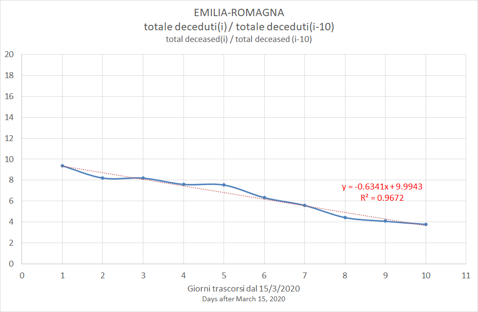

# Estimates for Emilia-Romagna

[Excel](COVID-19_emilia_romagna.xlsx)

|Estimate of|Best fit|a|b|c|R2|Estimated days from peak|Estimated peak date|
|-|-|-|-|-|-|-|-|
|25/03/2020|y = -0.0157x2 - 0.4609x + 9.6479|-0.0157|-0.4609|9.6479|0.971|28|12/04/2020|

### 25/03/2020

### 26/03/2020

