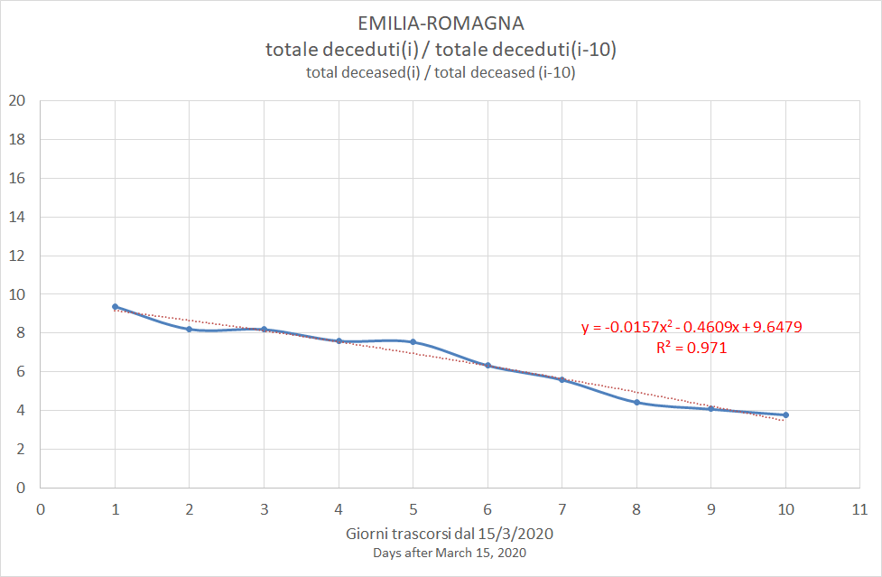
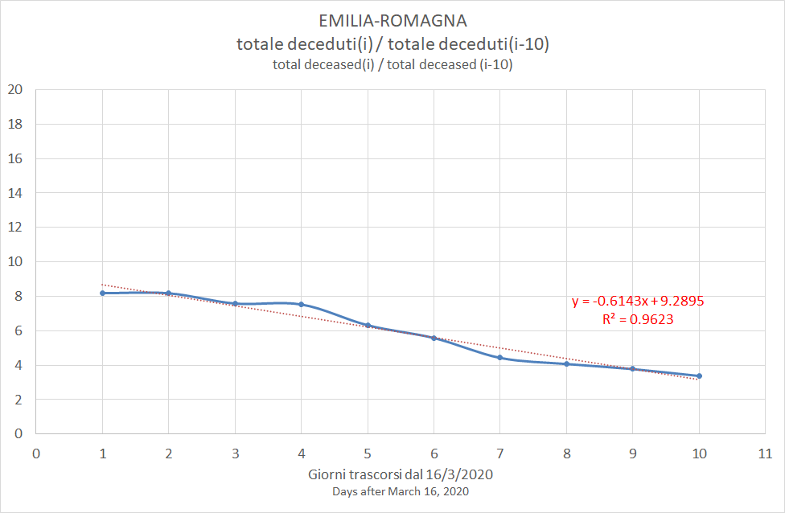
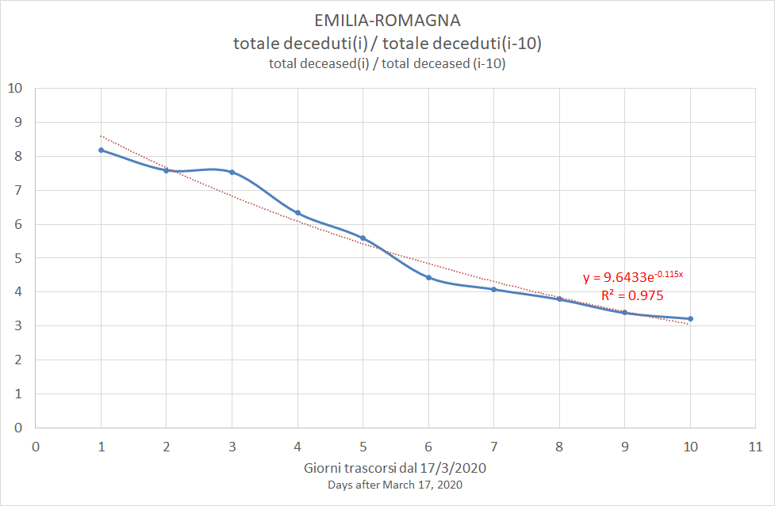

# Estimates for Emilia-Romagna

[Excel](COVID-19_emilia_romagna.xlsx)

|Estimate of|Best fit|Estimated days from peak|Estimated peak date|
|-|-|-|-|-|-|-|-|
|25/03/2020|y = -0.0157x2 - 0.4609x + 9.6479|28|12/04/2020|
|26/03/2020|y = -0.6143x + 9.2895|14|30/03/2020|
|27/03/2020|y = 9.6433e-0.115x|20|06/04/2020|

### 25/03/2020

### 26/03/2020

### 27/03/2020

