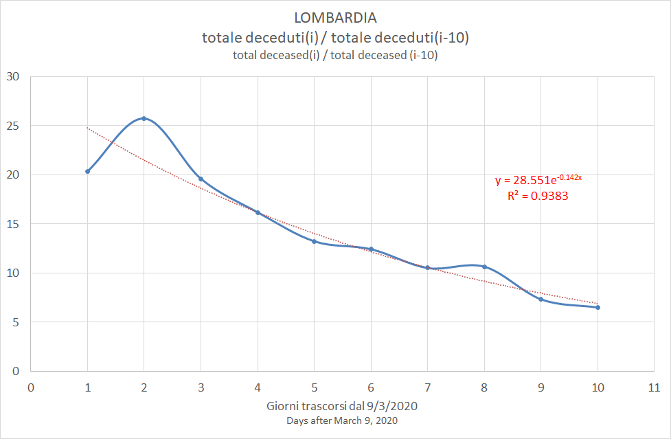
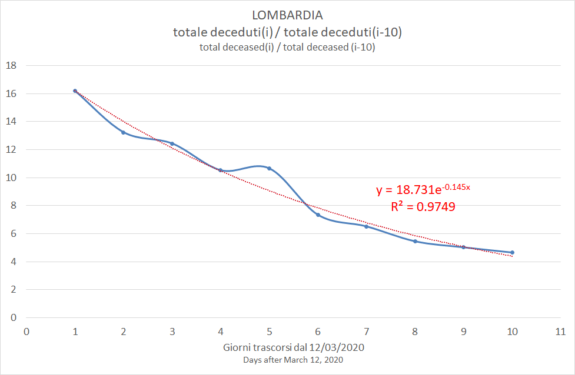
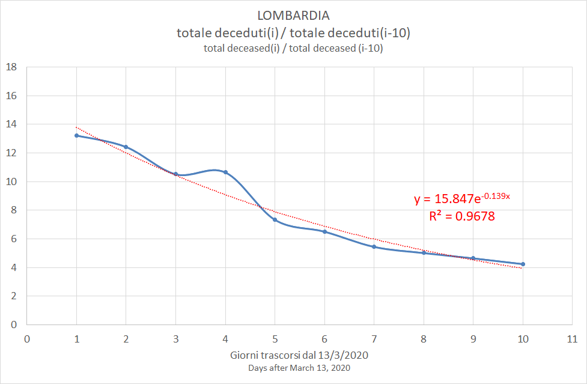
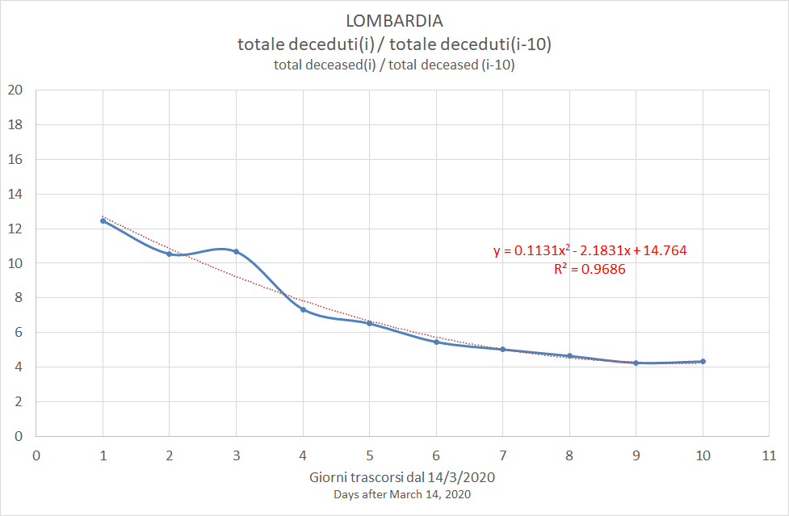

# Estimates for Lombardy

[Excel](../old/COVID-19_lombardy.xlsx)

Focusing on Lombardy from 12/3/2020 onward, the rate cumulated_deceased(i)/cumulated_deceased(10) is generally described by an exponential function. There are cases when the best fit is obtained with a logarythmic or a polynomial function.

The exponential function has the form y = a\*exp(b\*i). So it is less than 1 when i > -ln(a)/b. 

|Estimate of|Best fit|a|b|c|R2|Estimated days from peak|Estimated peak date|
|-|-|-|-|-|-|-|-|
|19/03/2020|y = 28.551e(-0.142x)|28.551|-0.142|-|0.9383|24|02/04/2020|
|20/03/2020|y = -8.551ln(x) + 25.675|-8.551|25.675|-|0.9887|18|28/03/2020|
|21/03/2020|y = 22.387e(-0.151x)|22.387|-0.151|-|0.9792|21|01/04/2020|
|22/03/2020|y = 18.731e(-0.145x)|18.731|-0.145|-|0.9749|20|01/04/2020|
|23/03/2020|y = 15.847e(-0.139x)|15.847|-0.139|-|0.9608|20|02/04/2020|
|24/03/2020|y = 13.418e(-0.129x)|13.418|-0.129|-|0.9389|20|03/04/2020|
|24/03/2020|y = 0.1131x2 - 2.1831x + 14.764|0.1131|-2.1831|14.764|0.9686|n.a.|n.a.|
|25/03/2020|y = 11.219(e-0.119x)|11.219|-0.119|-|0.9258|20|04/04/2020|
|25/03/2020|y = 0.1068x2 - 1.947x + 12.832|0.1068|-1.947|12.832|0.9526|n.a.|n.a.|

### 19/03/2020

### 20/03/2020

### 21/03/2020

### 22/03/2020

### 23/03/2020

### 24/03/2020

It is worth to note that data are better interpolated by a parabola.

This curve never reaches 1, so the tendency is never inverted.

### 25/03/2020

It is worth to note that data are better interpolated by a parabola.

This curve never reaches 1, so the tendency is never inverted.

